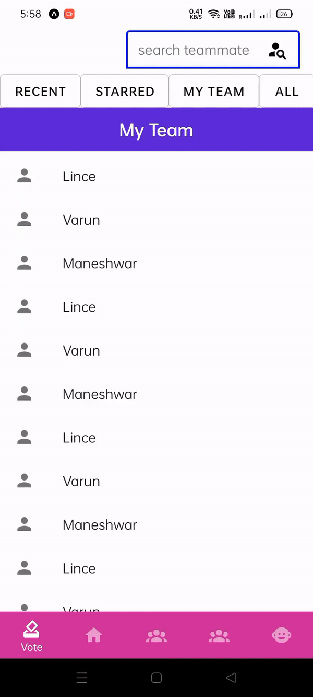

<div align="center">

# Biglist with tabs (React-Native)
<br>


[](https://prettier.io/)
[](http://npmjs.org/package/react-native-big-list)
## Manage biglist items by scrolling through section tabs 
</div>
<br/>

### 🎨 Screenshot
 
<br/>

### How to use ?
step:1
| npm                                        | yarn                             |
| ------------------------------------------ | -------------------------------- |
| `npm install FlyweightGroup/React-Native-Biglist-With-Tabs` | `yarn add FlyweightGroup/React-Native-Biglist-With-Tabs` |


step:2
`import BigListTab from 'BigList-With-Tabs'`


<br/>


### Basic Example

#### JavaScript
```
import BigListTab from 'BigList-With-Tabs'
// ...
const MyExample = ({ data }) => {
  ///provide your json data and onclick event through props..
  return <BigListTab sectiondata={data} onClickItem={your function}  />;
}
```

<br/>

### Remember !
Json format of the Section Data should be 
```
[
   [
      {
         "category":"section heading",
         "sectionId":"section id"
      },
      {
         "item1":"item"
      },
      {
         "item2":"item"
      }
   ],
   [
      {
         "category":"section heading",
         "sectionId":"section id"
      },
      {
         "item1":"item"
      },
      {
         "item2":"item"
      }
   ]
] 
``` 

### License 
MIT

